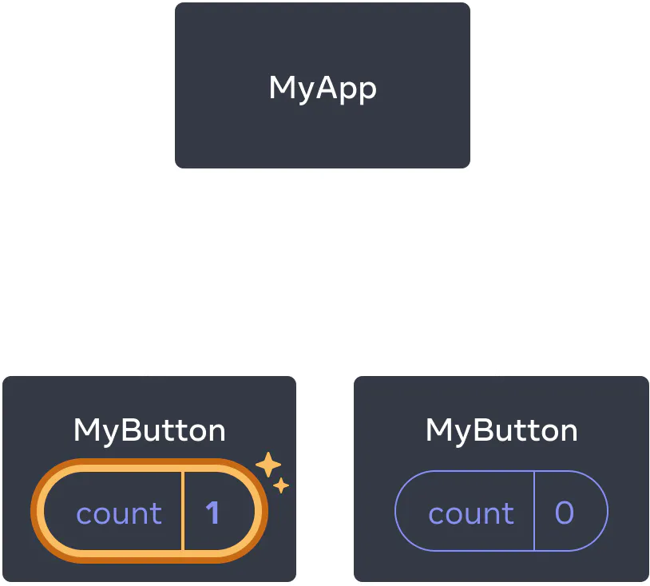
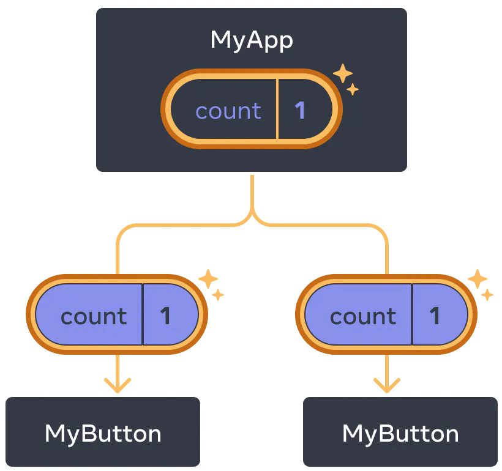

[](https://classroom.github.com/online_ide?assignment_repo_id=13843693&assignment_repo_type=AssignmentRepo)
# Assignment

Before you start anything you need to understand that the browser only knows how to deal with HTML/CSS/JS. Up until know you have only used those three so you can just open index.html and your page is rendered. You won't be able to do that anymore because you will be developing in other languages. You will need to have various libraries translate your work in HTML/CSS/JS so the browser can understand what is going on. That said, the first thing you will need to do is download those libraries. To do this you must open a new terminal by clicking `terminal` in the top menu bar and then selecting `new terminal`. You could always just use the quick key (Crtl+Shift+`). Now you can download those libraries by typing the following into the terminal

### `npm install`

If your curios as to what are those libraries, look in [package.json](./package.json) file under dependencies. After the download is complete you can now run your project with 

### `npm start`

In a few minutes a webrowser should open and show your new website.

This thing that you got going is called React. It is a `JS` Library. Within this project we are also using something called TypeScript(`TS`). TS is a microsoft library to add [strong typing](https://en.wikipedia.org/wiki/Strong_and_weak_typing) like in c#(private `float` speed). React also has something called `JSX`. This is JS that has special React features. Finally, you will see in this code a bunch of files with `TSX`. This is just JSX files that require strong typing.

When you look at your file tree there is a bunch of stuff. At this time you should disregard most of it. Focus in on what is being rendered, which if you looked at the rendered page you will see that it refers you to [src/App.tsx](./src/App.tsx). Notice how there is a function that has JS `and` HTML. Well that is JSX

```tsx
function App() {
  return ( //js return
    <div className="App"> <!--html stuff inside the return-->
      <header className="App-header">
        
        <p>
          Edit <code>src/App.tsx</code> and save to reload.
        </p>
        <a
          className="App-link"
          href="https://reactjs.org"
          target="_blank"
          rel="noopener noreferrer"
        >
          Learn React
        </a>
        <BlueButton />
      </header>
    </div>
  );
}
```

You can add a bunch of HTML, CSS, JS here and it will render. However, we don't want this file to get all cluttered. We want to build a bunch of smaller components and then call them here to be rendered.

Lets have a look at our first component.

```tsx
<a
    className="App-link"
    href="https://reactjs.org"
    target="_blank"
    rel="noopener noreferrer"
>
    Learn React
</a>
<BlueButton /> <-----------HERE IS THE CUSTOM COMPONENT
</header>
```

When you look at the above code the `<BlueButton />` should jump out at you. Judging by the render it makes a button that says `I'm a button`, but where is the code for that? Look at the top of the document and it will give you a hint.

```tsx
import React from 'react';
import logo from './logo.svg';
import './App.css';
import BlueButton from "./components/BlueButton" <-----------------
```

If you follow the location of BlueButton you will see its code. You can also click BlueButton and hit `f12`. Here is the code that makes the button

```tsx
import React from 'react'

const BlueButton: React.FC = () => {
    return (
      <button>I'm a button</button>
    );
  }

export default BlueButton
```

Why is the useful?

## Task 1 Code Reuse

Get two more buttons to render. Do not rewrite the BlueButton code, just call the `<BlueButton />` tag 2 more times inside [App.tsx](./src/App.tsx).

## Task 2 Connecting CSS

1. Inside the components/buttons folder create the file BlueButton.css.
2. Inside that file create a class called blue that colors the button blue.
3. Connect the CSS that you just made to the [BlueButton](./src/components/buttons/BlueButton.tsx) file in the same way it is done in App.tsx
```jsx
import './App.css';
```

Put the CSS on the button in a similar way shown below. Do not apply the CSS in App.tsx do it where you made the button in [BlueButton](./src/components/buttons/BlueButton.tsx)
```jsx
<a
    className="App-link" <-------------------------------
    href="https://reactjs.org"
    target="_blank"
    rel="noopener noreferrer"
>
```

## Task 3 Building Components

1. Add another button called `GreenButton` to components/buttons folder. This must have different words and style so you will need to make a GreenButton.css
2. Within components create a folder called lists
3. In lists make a component called `SimpleList` that returns a [list](https://www.w3schools.com/html/html_lists.asp) of things. Make sure it has CSS
4. Within components create a folder called tables
5. In tables make a component called `SimpleTable` that returns a [table](https://www.w3schools.com/html/html_tables.asp) of things. Make sure it has CSS
6. Add each of these to App.tsx

---
<br/>

Since HTML and JS are mixed how should you handle helper functions and events. Simple put all the JS/logic in with the component that needs it.

```tsx
const BlueButton: React.FC = () => {
  function handleClick() {
    alert('You clicked me!');
  }

  return (
    <button onClick={handleClick}> <------------
      Click me
    </button>
  );
}
```

Notice how you use `{}` brackets to call the function when clicked. These are used as an `escape` back to JS. Also notice that you don't actually use handleClick(), you remove the `()`. When `()` are on the end the function will run on render. However, you don't want it to run at render you only want it to run when it is clicked. So passing `handleClick` allows react to run the function when necessary.

## Task 4 Events
1. add an alert to the GreenButton component
---

Lets say you want to count the number of clicks a button recieves. In the past you just update the DOM with the JS and your good. Now the DOM is fully controlled by React. React does not change anything or re-render unless it detects a `state` change. React give us a special function for doing this. It is `useState`. It is called a `hook` and anything that starts with `use` is a hook. You can read all about Reacts hooks [here](https://react.dev/reference/react/hooks) and we need to import it like this.

```tsx
import { useState } from 'react';
```

Inside the component we setup the counting variable like so:

```tsx
const BlueButton: React.FC = () => {
  const [count, setCount] = useState(0);
  // ...
}
```

 In the example above `count` is the variable, `setCount` is what we must use to modify `count` and `useState(0)` means that count will start with the value of 0. So if you wanted to change `count` to 4 it would look like this

 ```tsx
 setCount(4)
 ```

 Remember to display the `count` variable you will need to include it between `{}`...like so
 
 ```tsx
<button onClick={handleClick}>
  Clicked {count} times
</button>
```

 ## Task 5 Updating State
 1. Modify BlueButton to show how many times the button has been clicked
 2. You will need to change the button like the above and you will need to create an onClick function
 3. Modify GreenButton to do the same as BlueButton and change its alert to a console.log("messge") because alerts are annoying

 ---

In the previous example GreenButton and BlueButton managed their own state so the count was only known by themselves. If we wanted the count to go up if either button was pressed then we need to pull that state out of the individual button and put it in their parent container. In our case that will be [App.tsx](./src/App.tsx)

This picture helps to understand



# The state is saved in the individual button



# The state is saved in the parent

Here is how you do this in code

```tsx
function App() {
  const [count, setCount] = useState(0);

  function handleClick() {
    setCount(count + 1);
  }

  return (
    <div>
      <h1>Counters that update separately</h1>
      <TwinButton count={count} onClick={handleClick} /> <-----------props
      <TwinButton count={count} onClick={handleClick} />
    </div>
  );
}
```

When you pass down information to another component like you see in TwinButton it is called props or "pass it down through the props"

Now you need to make a TwinButton it will be similar to GreenButton but look like this

```tsx
interface TwinButtonProps {
    count: number;
    onClick: () => void;
  }

const TwinButton: React.FC<TwinButtonProps> = ({ count, onClick})=> { <------------ props
  return (
    <button onClick={onClick}>
      Clicked {count} times
    </button>
  );
}
```

## Task 6 Props
1. Inside components/buttons make a TwinButton Component
2. Modify the [App.tsx](./src/App.tsx) to handle the `click` and `count` state
3. Import TwinButton
4. Render 3 TwinButtons

---

Thus far you have only made static websites. That means the site looks the same no matter who is looking at it and nothing changes until you change it in your code. React is a tool that can help you make dynamic websites like Amazon, Netflix or Youtube. In a dynamic website you recieve data from the server and then render that data inside your components. You may also have a static site with a lot of data to render.

In this example you already have access to a lot of server like data

```tsx
import BlueButton from "./components/buttons/BlueButton"
import mockData from './dummy.json'; <-------------- PRACTICE DATA

function App() {
  return (
    <div className="App">
      <header className="App-header">
        
        <p>
          Edit <code>src/App.tsx</code> and save to reload {mockData[0].email}. <----------USING THE PRACTICE DATA
        </p>
```

To view the data go to [dummy.json](./src/dummy.json). This data is just an array with a bunch of stuff inside. You will often get arrays of data from a server so you need to know of easy ways to manage this data. In this case you want to make an ordered list with the name of each record in the array
```json
[
  {
  "name": "Yara", <------------------NAME
  "email": "yara@hotmail.com",
  "id": 225
  },
  {
  "name": "William", <---------------NAME
  "email": "william@outlook.com",
  "id": 42
  },
  ...
```

Of course you could [hard code](https://en.wikipedia.org/wiki/Hard_coding) a list like this

```tsx
<ol>
  <li>Perry</li>
  <li>Tommy</li>
  <li>Jane</li>
  ...
  ...
  ...
  ...
  <li>Mary</li> <---------Mary is the 1 millionth person
</ol>
```

Hard coding this much data would take a life time and what if the names changed. You now have a much faster and easier way to manage this

```tsx
const users = [ <-----------GIVEN THIS DATA
  {
  "name": "Yara",
  "email": "yara@hotmail.com",
  "id": 225
  },
  {
  "name": "William",
  "email": "william@outlook.com",
  "id": 42
  },
  ...


const listItems = users.map(user =>
  <li key={user.id}>
    {user.name}
  </li>
);

return (
  <ul>{listItems}</ul>
);
```

## Task 7

1. Inside components/tables create a new table component called DynamicTable
2. Make the table heads ID, Name, Email
3. Make a table body
4. Make each table row have id, name, email from the its users prop, not directly from dummy.json

You will need to use the folling code to start off your component

```tsx
interface DynamicTableProps {
    users:{
        name: string,
        email: string,
        id: number
    }[]
  }

const DynamicTable: React.FC<DynamicTableProps> = ({ users })=> {
```
5. Call the table at the bottem of App.tsx, make sure to pass in the mockData to the users prop
6. When rendered your table should have 28 rows

<br/>
<br/>

# -------The below documentation is for the app not the lesson--------

# Getting Started with Create React App

This project was bootstrapped with [Create React App](https://github.com/facebook/create-react-app).

## Available Scripts

In the project directory, you can run:

### `yarn start`

Runs the app in the development mode.\
Open [http://localhost:3000](http://localhost:3000) to view it in the browser.

The page will reload if you make edits.\
You will also see any lint errors in the console.

### `yarn test`

Launches the test runner in the interactive watch mode.\
See the section about [running tests](https://facebook.github.io/create-react-app/docs/running-tests) for more information.

### `yarn build`

Builds the app for production to the `build` folder.\
It correctly bundles React in production mode and optimizes the build for the best performance.

The build is minified and the filenames include the hashes.\
Your app is ready to be deployed!

See the section about [deployment](https://facebook.github.io/create-react-app/docs/deployment) for more information.

### `yarn eject`

**Note: this is a one-way operation. Once you `eject`, you can’t go back!**

If you aren’t satisfied with the build tool and configuration choices, you can `eject` at any time. This command will remove the single build dependency from your project.

Instead, it will copy all the configuration files and the transitive dependencies (webpack, Babel, ESLint, etc) right into your project so you have full control over them. All of the commands except `eject` will still work, but they will point to the copied scripts so you can tweak them. At this point you’re on your own.

You don’t have to ever use `eject`. The curated feature set is suitable for small and middle deployments, and you shouldn’t feel obligated to use this feature. However we understand that this tool wouldn’t be useful if you couldn’t customize it when you are ready for it.

## Learn More

You can learn more in the [Create React App documentation](https://facebook.github.io/create-react-app/docs/getting-started).

To learn React, check out the [React documentation](https://reactjs.org/).
